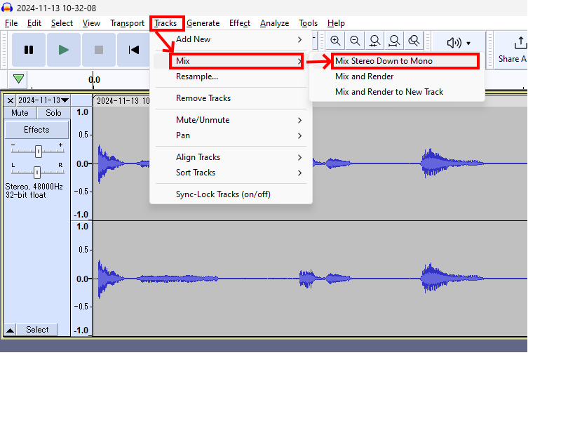
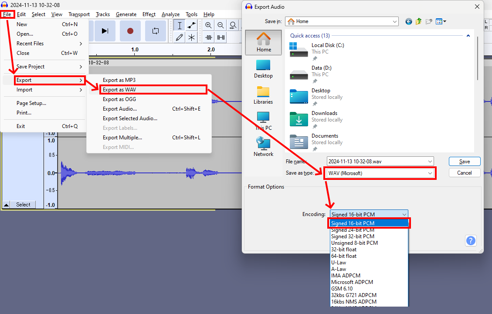

# RP2040W_FSM_Audio_player
WAV audio player using a finite state machine (FSM) to switch tracks using switch inputs.

The FSM configuration and audio files are stored on and SD-card.

- the FSM config is set in a .json file, through this file you can select how many states, what state(s) it can transition to, what condition(s) has to be fulfilled for it to move to another state, and finally what music folder to play sound from. Detailed instructions on .json config can be found further below.

- Audio files the music player is configured to play are 16 bit (PCM) .WAV files (mono recomended). Any audio (or audio from a video file) can easily be converted to this format using Audacity (https://www.audacityteam.org/). Detailed instructions on how to make sure the file is in correct format can be found just below.

- Currently only on/off switch inputs are supported for conditions to change states.

- Quickstart guide can be found in "yeah buddy.md" #todo


# .WAV export

So far i have found the best audio quality which the controller handles 100% reliably is when exported with the following quality:

### Mixed down to mono
Stereo tracks work, however take more bandwidth and can start making wierd popping noises if the controller cant keep up



### Export as 16 bit PCM (.WAV)
This is lossless audio meaning it has excellect quality, and it is less heavy on the rp2040 as it quite fast to parse since its not compressed. 16 Bit is the highest before the bandwidth again starts becoming a problem in my testing.



# RP2040 Audio Player JSON Configuration Guide

Your JSON configuration file for the RP2040 audio player must describe a series of states, each associated with an audio file and a set of transitions that trigger the FSM (Finite State Machine) to move to a new state based on various conditions.

### Overview

Each element within `"states"` represents one state in the FSM and includes the following key properties:

- A unique numeric `id` for the state.
- An `audioFile` specifying the path to the audio resource.
- A `repeat` flag indicating whether the audio should loop.
- A `blinkCount` value specifying the number of LED blinks while in this state.
- A `transitions` array, which defines how and when to move from this state to another.

At runtime, the FSM performs the following:

1. Loads and parses this JSON configuration from the SD card.
2. Starts at `state.id = 0` by default.
3. Continuously evaluates conditions specified in the `transitions` for each state.

Internally, the FSM also handles "skip" and "reset" transitions. These are automatically added to each state and allow for skipping to the next state or resetting to the initial state. No need to add these in the .json config file.

### JSON Structure

#### Top-Level Structure

```json
{
  "states": [
    {
      "id": <number>,
      "audioFile": "<string>",
      "repeat": <boolean>,
      "blinkCount": <number>,
      "transitions": [
        {
          "targetState": <number>,
          "conditions": [
            {
              "type": "<string>",
              "data": {
                // Condition-specific data fields
              }
            }
          ]
        }
      ]
    }
    // Additional state objects...
  ]
}
```

- **`id`**: A numeric identifier for the state. It must be unique and typically zero-based.
- **`audioFile`**: Path to the audio resource on the SD card (e.g., `"/music/state_0/"`).
- **`repeat`**: Boolean (`true` or `false`) indicating whether the audio should loop.
- **`blinkCount`**: The number of times the LED should blink while in this state.
- **`transitions`**: A list of transitions. Each transition defines the conditions under which the FSM should move to another state.

### Transitions

Each state can have multiple transitions. Each transition specifies a `targetState` and one or more `conditions`. **All conditions within a transition must be satisfied simultaneously for the FSM to proceed to the `targetState`.**

#### Transition Fields
- **`targetState` (number)**: The ID of the state to transition to if all conditions are met.
- **`conditions` (array)**: A list of condition objects that must all be true for the transition to occur.

### Conditions

Conditions define what needs to be checked in order for the FSM to change states. Each condition includes a `type` and a `data` object, which specifies the parameters for that condition.

#### Supported Condition Types

1. **SENSOR**: Checks the logical state of a sensor input pin.
   - **Data Fields**:
     - **`sensorPin` (number)**: The index of the sensor pin to read.
     - **`state` (boolean)**: The expected logical state (`true` or `false`) for the condition to be met. (Meaning is the switch connected to the sensor pin closen or open)

   **Example SENSOR Condition**:
   ```json
   {
     "type": "SENSOR",
     "data": {
       "sensorPin": 1,
       "state": false
     }
   }
   ```

2. **TIME_PASSED**: Checks if a certain amount of time has elapsed since entering the current state.
   - **Data Fields**:
     - **`duration` (number)**: The required time in milliseconds.

   **Example TIME_PASSED Condition**:
   ```json
   {
     "type": "TIME_PASSED",
     "data": {
       "duration": 5000
     }
   }
   ```

3. **AUDIO_FINISHED**: Checks if the current audio has finished playing. This condition type requires no additional `data` fields.

   **Example AUDIO_FINISHED Condition**:
   ```json
   {
     "type": "AUDIO_FINISHED"
   }
   ```

*(Note: `SKIP_FLAG` and `RESET_FLAG` are added internally and do not need to be included in the JSON.)*

### Example JSON Configuration

Below is an example configuration:

```json
{
  "states": [
    {
      "id": 0,
      "audioFile": "/music/state_0/",
      "repeat": false,
      "blinkCount": 1,
      "transitions": [
        {
          "targetState": 1,
          "conditions": [
            {
              "type": "SENSOR",
              "data": {
                "sensorPin": 1,
                "state": false
              }
            }
          ]
        }
      ]
    },
    {
      "id": 1,
      "audioFile": "/music/state_1/",
      "repeat": false,
      "blinkCount": 2,
      "transitions": [
        {
          "targetState": 2,
          "conditions": [
            {
              "type": "SENSOR",
              "data": {
                "sensorPin": 2,
                "state": false
              }
            }
          ]
        }
      ]
    }
    // Additional states...
  ]
}
```

**Explanation**:
- **State 0**:
  - Audio `/music/state_0/` is played once (`repeat: false`).
  - The LED blinks once per cycle (`blinkCount: 1`).
  - Transition to `state 1` occurs if `sensorPin 1` reads `false`.
- **State 1**:
  - Audio `/music/state_1/` is played once.
  - The LED blinks twice per cycle (`blinkCount: 2`).
  - Transition to `state 2` occurs if `sensorPin 2` reads `false`.

### Key notes:

1. **Example JSON structure**: An example json structure is located in the root folder of the repository, you may use this and edit to fit your needs.

2. **Ensure Valid JSON Structure**: The JSON must have a top-level `"states"` array. Each state must have valid fields (`id`, `audioFile`, `repeat`, `blinkCount`, `transitions`).

3. **Unique and sequentiual State IDs**: Start with `id` = 0 and increment sequentially. Ensure every state has a unique ID.

4. **Blink count**: The blink count is there to help debug/identify which state the controller is in, since states are zero indexed, to get positive feedback from the leds also at state id 0 its reccomended to let blink count be equal to `id + 1` (So counting from 1 and up in the json.)

5. **JSON file verification**: When editing json files it can be helpful to use an online JSON file editor to validate you get the correct order and number of `[]` and `{}`.

6. **Availible sensor pins**: There are eight sensor pins availible, they are 0-7. They are all labled accordingly on the PCB itself.

7. **Correct Condition Data**: The conditions field in the .json must specify the correct `data` fields given its `type`. Missing or incorrect fields (e.g., missing `sensorPin` in a `SENSOR` condition) will lead to errors or undefined behavior.

8. **Consistent State References**: Verify that all `targetState` references exist (e.g., if a transition points to `state 3`, ensure a state with `id: 3` exists).

9. **Audio Resource Availability**: Make sure the paths provided in `audioFile` exist on the SD card and are readable by the firmware.

